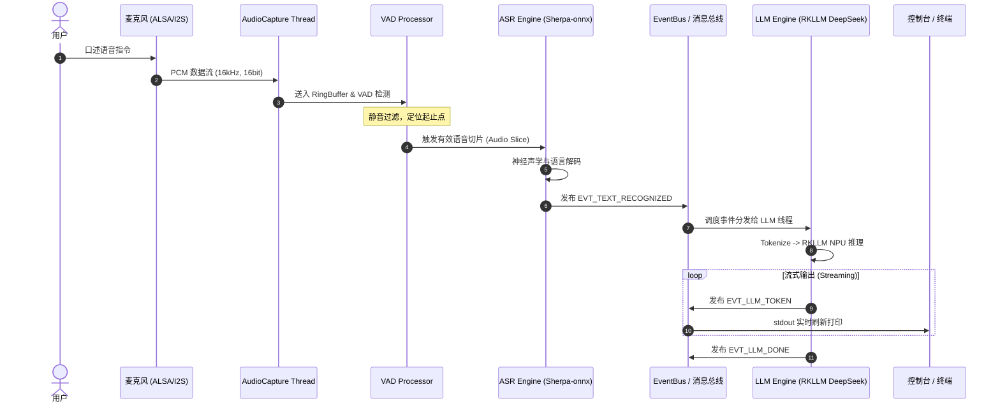
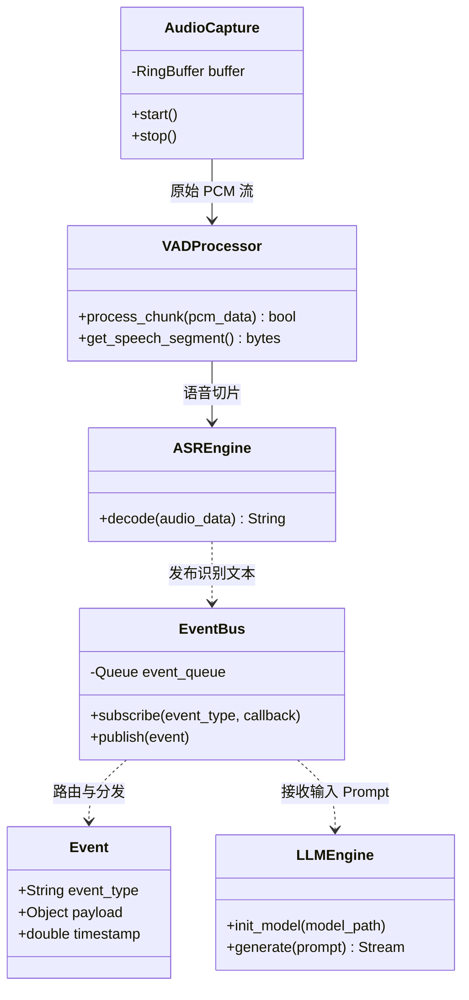
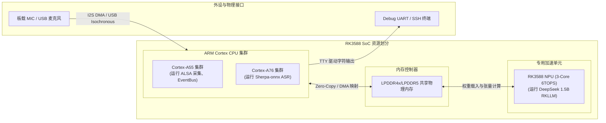

# RK3588 边缘端语音大模型交互系统设计文档 (Phase 1)

## 1. 文档概述

### 1.1 设计背景

本项目基于正点原子 RK3588 嵌入式开发板，在已跑通官方 DeepSeek 1.5B (RKLLM) 终端推理的基础上，构建一个支持本地麦克风实时拾音、端侧离线语音识别 (ASR)、大模型语义推理并流式输出的完整系统框架。

### 1.2 设计目标

* **低延迟与本地化**：全链路离线运行，无需外网 API，保证响应确定性与隐私安全。
* **高可扩展性**：采用事件驱动架构与解耦设计，第一阶段聚焦“语音输入 $\to$ ASR $\to$ LLM $\to$ 终端流式打印”，为后续阶段接入 TTS 及底层外设驱动（GPIO/PWM/I2C/SPI）预留统一抽象。
* **硬件异构利用**：CPU（大小核集群）负责高吞吐音频流与声学解码，NPU 专职处理大语言模型张量运算。

---

## 2. 系统需求与架构原则

### 2.1 功能需求

1. **音频采集**：支持配置采样率（16kHz、16-bit、Mono）、设备节点选择与底层 PCM 数据无阻塞抓取。
2. **端点检测 (VAD)**：自适应检测说话起止点，消除静音段与噪声开销。
3. **语音识别 (ASR)**：将有效语音片段解码为高准确度文本。
4. **模型调度 (LLM)**：上下文管理、Prompt 装配与 RKLLM 推理调度。
5. **流式响应**：LLM 生成的 Token 实时流式推送到标准输出。

### 2.2 非功能需求与设计原则

* **线程隔离**：音频采集线程不得受计算密集型任务（ASR/LLM）阻塞。
* **数据流解耦**：生产者与消费者之间通过无锁或轻量队列隔离，禁止跨层硬编码调用。
* **错误隔离**：ASR 识别失败或空输入不得导致主进程崩溃，需支持平滑丢弃与状态复位。

---

## 3. 系统 4+1 视图设计

### 3.1 场景视图 (Use Case & Scenario)

#### 核心场景：用户语音指令输入至控制台响应



---

### 3.2 逻辑视图 (Logical View)

系统按功能分层，从下至上分为硬件适配、核心引擎、消息路由与呈现层：

* **音频接入模块 (`AudioCapture`)**：抽象 ALSA / PortAudio 接口，管理底层缓冲区生命周期。
* **感知引擎模块 (`PerceptionEngine`)**：
* `VADProcessor`：封装 Silero-VAD 状态机，负责音频切片。
* `ASREngine`：封装 Sherpa-onnx (SenseVoice/Paraformer)，提供单向流式或离线批处理解码。


* **认知推理模块 (`LLMEngine`)**：抽象 RKLLM C-API / Python-Binding，维护对话上下文（History Context）并触发 NPU 前向传播。
* **事件中枢 (`EventBus`)**：单进程内发布/订阅通道，标准化传递 `Event` 对象。



---

### 3.3 运行视图 (Process View)

> **实施修订 (2026-09-15)**: 实际落地为 **3 工作线程 + 无调度线程的轻量事件总线**
> (actor 信箱模式): `EventBus::publish()` 在生产者线程内同步把事件 move 进各订阅者的
> 有界队列, 不设专职调度线程 —— 比原方案少一次跨线程跳变, 延迟更低。
> 事件契约(4.1)不变; 未来 TTS/GPIO 以 `subscribe()` 接入, 现有模块零改动。
> 实现见 `include/event_bus.hpp`, 详见 `docs/plans/2026-09-15-sound-recv-framework.md`。

系统采用多线程并发架构，消除音频采集抖动与 NPU 满载带来的事件丢失风险：

```mermaid
flowchart TB
    subgraph Process_Main["主进程 (Main Process)"]
        subgraph Thread_Audio["Thread 1: Audio Capture (实时优先级)"]
            T1_Run["ALSA 循环读取"] --> T1_Write["写入 RingBuffer"]
        end

        subgraph Thread_ASR["Thread 2: ASR & VAD (普通优先级)"]
            T2_Read["消费 RingBuffer"] --> T2_VAD{"VAD 检测"}
            T2_VAD -- 静音 --> T2_Read
            T2_VAD -- 触发语音块 --> T2_Decode["Sherpa-onnx 解码"]
            T2_Decode --> T2_Push["投递 EVT_TEXT_RECOGNIZED"]
        end

        subgraph Thread_Bus["Thread 3: EventBus 调度 (事件驱动)"]
            T3_Pop["从 EventQueue 获取事件"] --> T3_Route["分发到订阅者队列"]
        end

        subgraph Thread_LLM["Thread 4: RKLLM 推理 (计算密集型)"]
            T4_Recv["获取 Prompt 事件"] --> T4_NPU["RKLLM 硬件推理"]
            T4_NPU --> T4_Emit["循环回调产生 Token"]
            T4_Emit --> T4_Print["直接刷写终端 / 投递 EVT_TOKEN"]
        end
    end

    T1_Write -. 共享内存缓冲区 .-> T2_Read
    T2_Push -. 线程安全队列 .-> T3_Pop
    T3_Route -. 线程安全队列 .-> T4_Recv

```



---

### 3.4 开发视图 (Development View)

统一的代码组织形式，清晰界定依赖边界与源码分类：

rk3588-voice-assistant/
├── CMakeLists.txt                      # 顶层 CMake 构建配置
├── cmake/
│   └── FindRKLLM.cmake                 # RKLLM 库定位脚本
├── third_party/                        # 第三方源码/轻量头文件依赖
│   ├── concurrentqueue/                # MoodyCamel 高性能无锁跨线程队列 (单个头文件)
│   │   └── concurrentqueue.h
│   └── json/                           # 现代 JSON 库 (用于参数配置)
│       └── json.hpp
├── 3rdparty_libs/                      # 预编译第三方动态库/头文件 (aarch64)
│   ├── sherpa-onnx/
│   │   ├── include/                    # c-api.h / sherpa-onnx/cxx/*.h
│   │   └── lib/                        # libsherpa-onnx-core.so, libonnxruntime.so
│   └── rkllm/
│       ├── include/                    # rkllm.h
│       └── lib/                        # librkllm_rt.so
├── include/                            # 模块公共接口头文件
│   ├── common/
│   │   ├── types.hpp                   # 全局数据结构 (AudioChunk, AsrResult, Event)
│   │   └── ring_buffer.hpp             # 音频环形无锁缓冲
│   ├── audio/
│   │   └── alsa_capture.hpp            # 基于 libasound 的音频采集器
│   ├── engine/
│   │   ├── vad_silero.hpp              # Silero-VAD 状态机包装
│   │   ├── asr_sherpa.hpp              # sherpa-onnx C++ 包装
│   │   └── llm_rkllm.hpp               # librkllm_rt 运行时包装
│   └── core/
│       └── pipeline_manager.hpp        # 状态机与流水线调度中枢
├── src/                                # 模块实现代码
│   ├── main.cpp                        # 进程入口：信号处理、配置载入、线程拉起
│   ├── audio/
│   │   └── alsa_capture.cpp            # ALSA PCM 读取与重采样 (如需)
│   ├── engine/
│   │   ├── vad_silero.cpp
│   │   ├── asr_sherpa.cpp
│   │   └── llm_rkllm.cpp
│   └── core/
│       └── pipeline_manager.cpp
├── configs/
│   └── config.json                     # 统一参数配置文件 (声卡设备、模型路径等)
└── models/                             # 模型权重存放目录
    ├── vad/silero_vad.onnx
    ├── asr/sensevoice/
    └── llm/deepseek_1.5b.rkllm

---

### 3.5 物理视图 (Physical View)

RK3588 片上资源及总线在软件组件中的映射分配：



---

## 4. 接口与数据契约设计

### 4.1 事件契约定义 (Event Definitions)

所有系统内部通信遵循结构化事件格式：

| 事件名称 | 产生源 | 消费源 | Payload 字段说明 |
| --- | --- | --- | --- |
| `EVT_AUDIO_CHUNK` | `AudioCapture` | `VADProcessor` | `{"data": bytes, "frames": int, "rate": 16000}` |
| `EVT_SPEECH_START` | `VADProcessor` | 状态监控 | `{"timestamp": float}` |
| `EVT_SPEECH_END` | `VADProcessor` | `ASREngine` | `{"audio_segment": bytes, "duration_ms": int}` |
| `EVT_TEXT_RECOGNIZED` | `ASREngine` | `LLMEngine` | `{"text": str, "latency_ms": float}` |
| `EVT_LLM_TOKEN` | `LLMEngine` | 终端/UI | `{"token": str, "index": int}` |
| `EVT_LLM_DONE` | `LLMEngine` | 上下文管理 | `{"full_text": str, "total_tokens": int}` |

### 4.2 模块核心 API 规范

```python
# 示例：AI 模块抽象基类
class BaseASREngine:
    def initialize(self, model_dir: str, num_threads: int = 2) -> bool:
        """加载 ONNX 模型，初始化解码器"""
        pass

    def transcribe(self, pcm_bytes: bytes, sample_rate: int = 16000) -> str:
        """接收单次有效音频片段，返回识别文本"""
        pass

class BaseLLMEngine:
    def initialize(self, model_path: str, max_context_len: int = 2048) -> bool:
        """载入 RKLLM 权重文件，初始化 NPU Context"""
        pass

    def stream_generate(self, prompt: str):
        """生成器函数：流式 yield 输出字符 token"""
        pass

```

---

## 5. 依赖清单与环境配置规范

### 5.1 系统环境与驱动要求

* **OS 版本**：Ubuntu 22.04 LTS (aarch64) 或 Debian 11/12
* **Linux Kernel**：Linux 5.10.x（正点原子官方适配版本）
* **NPU 驱动**：`rknpu.ko` 版本 $\ge$ 0.9.x
* **基础工具**：`cmake` $\ge$ 3.20, `gcc/g++` $\ge$ 10.0, `Python` 3.10+

### 5.2 系统库依赖 (APT)

```bash
sudo apt-get update && sudo apt-get install -y \
    build-essential \
    pkg-config \
    alsa-utils \
    libasound2 \
    libasound2-dev \
    libportaudio2 \
    portaudio19-dev \
    python3-pip \
    python3-dev

```

### 5.3 Python 运行时依赖 (`requirements.txt`)

```text
# 核心计算与数据处理
numpy>=1.23.0
pyyaml>=6.0

# 音频抓取
sounddevice>=0.4.6

# ASR 推理框架 (支持 aarch64 预编译)
sherpa-onnx>=1.10.0

# 控制台排版输出
colorama>=0.4.6

```

### 5.4 专有 AI 依赖

* **RKLLM 运行时**：
* `librkllm_rt.so` (部署在 `/usr/lib/` 或动态库链接路径)
* `rkllm_runtime` Python Wheel（版本需与开发板固件内 RKNPU2 驱动匹配）


* **离线模型权重**：
* VAD：`silero_vad.onnx`
* ASR：`sherpa-onnx-sense-voice-zh-en-ja-ko-yue-2024-07-17` (包含 `model.int8.onnx` 和 `tokens.txt`)
* LLM：`deepseek_1.5b.rkllm` (经过 RKLLM-Toolkit 转换的量化模型文件)


---

## 6. 验证方案与实施步骤

### 6.1 阶段一验证路线图

1. **音频采集通路验收**：
* 运行 `arecord -D hw:X,Y -d 3 -f S16_LE -r 16000 test.wav`。
* 验证 `aplay test.wav` 回放声音是否清晰无破音。


2. **ASR 端侧独立验收**：
* 将 `test.wav` 传入 `ASREngine` 单测脚本，验证解码耗时（A76 核心上 SenseVoice 离线解码应在 200ms 以内完成）。


3. **RKLLM NPU 独立验收**：
* 调用现有的命令行推理脚本，确认 DeepSeek 1.5B 首字延迟 (TTFT) 及推理速度符合预期。


4. **全链路串联验证**：
* 启动主应用，麦克风采集音频，VAD 截断，控制台打印识别出的 Prompt，随后无缝开始打印 DeepSeek 流式生成的回答。


### 6.2 异常处理与边界用例

* **无输入静音超时**：VAD 在预设时间内（如 10 秒）未捕捉到能量变化，自动释放临时缓冲并提示用户。
* **噪音误触发**：ASR 输出为空字符串时，终止向 LLM 投递事件，直接回到监听就绪状态。
* **NPU 忙状态**：当上一轮 LLM 推理未完成时，暂停新的 ASR 处理，或将新音频帧丢弃以防队列积压。